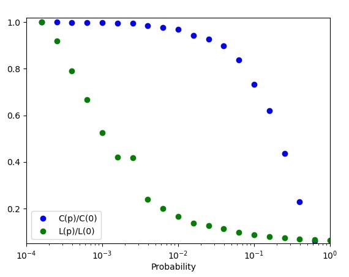

# Python implementation of Small World Networks
Python module implementing [Collective Dynamics Of Small World Networks](resources/Watts-CollectiveDynamicsOfSmallWorldNetworks.pdf)  by Watts and Strogatz. Additional implementation details at: [Small World Networks Implementation Details](resources/Implementation%20details.pdf))

#### Plot showing onset of "Small World Network" effect
The "Small World" phenomenon is shown by the generated graph, where the drop in Lp takes place much earlier than the drop in Cp, indicating that the transition to a small world is almost undetectable at the local level.

